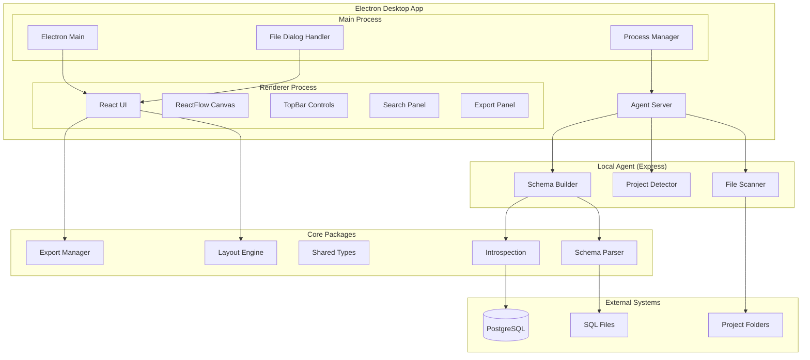

# Design Document

## Overview

This design document outlines the architecture and implementation approach for completing the PostgreSQL Schema Visualization Desktop Application. The application builds upon an existing solid foundation with working database introspection, basic SQL parsing, and React-based visualization. This design focuses on the missing components needed to achieve a professional, local-first desktop tool that can visualize PostgreSQL schemas from any project.

The core philosophy maintains clean separation of concerns across the monorepo structure, with no business logic in UI components and no UI logic in backend services. The design emphasizes local-first operation, cross-platform compatibility, and contributor-friendly architecture.

## Architecture

### High-Level Architecture



### Component Interaction Flow

1. **User Input** → TopBar component captures data source selection
2. **IPC Communication** → Electron main process handles file system access
3. **API Requests** → Agent processes schema extraction requests
4. **Schema Building** → Multiple sources merged into unified schema
5. **Visualization** → ReactFlow renders interactive diagram
6. **Layout Processing** → Automatic arrangement algorithms applied
7. **Export/Persistence** → Multiple output formats and state saving

## Components and Interfaces

### Enhanced File Scanner (`packages/file-scanner/`)

**New Package**: Handles project folder analysis and SQL file discovery.

```typescript
interface FileScanner {
  scanProject(projectPath: string): Promise<ProjectScanResult>
  findSqlFiles(directories: string[]): Promise<SqlFile[]>
  detectMigrationOrder(files: SqlFile[]): SqlFile[]
}

interface ProjectScanResult {
  projectPath: string
  detectedFolders: DetectedFolder[]
  sqlFiles: SqlFile[]
  migrationFiles: SqlFile[]
  summary: ScanSummary
}

interface DetectedFolder {
  path: string
  type: 'backend' | 'server' | 'api' | 'db' | 'database' | 'migrations'
  confidence: number
  sqlFileCount: number
}

interface SqlFile {
  path: string
  name: string
  size: number
  lastModified: Date
  type: 'table' | 'migration' | 'view' | 'function' | 'unknown'
  migrationOrder?: number
}
```

**Implementation Strategy**:
- Recursive directory traversal with configurable depth limits
- Pattern matching for common backend folder structures
- File type detection based on content analysis
- Migration file ordering using timestamp/sequence detection
- Parallel processing for large directory structures

### Enhanced SQL Parser (`packages/schema-parser/`)

**Extension**: Add foreign key parsing and ALTER TABLE support to existing parser.

```typescript
interface EnhancedSqlParser extends SqlParser {
  parseAlterTable(sql: string): AlterTableStatement[]
  extractForeignKeys(statements: ParsedStatement[]): Relation[]
  parseConstraints(sql: string): Constraint[]
  validateSyntax(sql: string): ValidationResult
}

interface AlterTableStatement {
  tableName: string
  action: 'ADD_CONSTRAINT' | 'DROP_CONSTRAINT' | 'ADD_COLUMN' | 'DROP_COLUMN'
  constraint?: ForeignKeyConstraint
  column?: Column
}

interface ForeignKeyConstraint {
  name?: string
  sourceColumns: string[]
  targetTable: string
  targetColumns: string[]
  onDelete?: 'CASCADE' | 'SET_NULL' | 'RESTRICT' | 'NO_ACTION'
  onUpdate?: 'CASCADE' | 'SET_NULL' | 'RESTRICT' | 'NO_ACTION'
}
```

**Parsing Strategy**:
- Extend existing pgsql-parser integration
- Handle inline REFERENCES clauses in CREATE TABLE
- Parse ALTER TABLE ADD CONSTRAINT FOREIGN KEY statements
- Support named and unnamed constraints
- Extract referential actions (CASCADE, SET NULL, etc.)

### Schema Builder (`packages/schema-builder/`)

**New Package**: Merges multiple data sources into unified schema.

```typescript
interface SchemaBuilder {
  buildFromSources(sources: SchemaSource[]): Promise<Schema>
  mergeSources(schemas: Schema[]): Schema
  prioritizeSources(sources: SchemaSource[]): SchemaSource[]
  resolveConflicts(conflicts: SchemaConflict[]): Schema
}

interface SchemaSource {
  type: 'database' | 'sql_files' | 'migration_files'
  priority: number
  schema: Schema
  metadata: SourceMetadata
}

interface SourceMetadata {
  connectionString?: string
  filePaths?: string[]
  lastUpdated: Date
  tableCount: number
  relationCount: number
}

interface SchemaConflict {
  type: 'table_definition' | 'column_type' | 'constraint_mismatch'
  tableName: string
  columnName?: string
  sources: SchemaSource[]
  resolution: 'prefer_database' | 'prefer_newest' | 'manual'
}
```

**Merging Strategy**:
- Database schema takes highest priority
- SQL files provide fallback for missing tables
- Migration files show historical evolution
- Conflict resolution with user preferences
- Metadata tracking for source attribution

### Layout Engine (`packages/layout-engine/`)

**New Package**: Automatic table arrangement algorithms.

```typescript
interface LayoutEngine {
  applyHierarchicalLayout(schema: Schema, options: LayoutOptions): LayoutResult
  applyForceDirectedLayout(schema: Schema, options: LayoutOptions): LayoutResult
  applyGridLayout(schema: Schema, options: LayoutOptions): LayoutResult
  optimizeLayout(currentLayout: LayoutResult): LayoutResult
}

interface LayoutOptions {
  algorithm: 'hierarchical' | 'force_directed' | 'grid' | 'circular'
  direction: 'top_down' | 'left_right' | 'bottom_up' | 'right_left'
  spacing: {
    nodeSpacing: number
    layerSpacing: number
    edgeSpacing: number
  }
  constraints: LayoutConstraint[]
}

interface LayoutResult {
  nodes: PositionedNode[]
  edges: PositionedEdge[]
  bounds: BoundingBox
  metadata: LayoutMetadata
}

interface PositionedNode {
  id: string
  position: { x: number; y: number }
  size: { width: number; height: number }
  layer?: number
  rank?: number
}
```

**Algorithm Implementation**:
- **Hierarchical Layout**: Based on foreign key relationships, root tables at top
- **Force-Directed Layout**: Physics simulation for organic arrangement
- **Grid Layout**: Structured arrangement for large schemas
- **Optimization**: Minimize edge crossings and maximize readability

### Export Manager (`packages/export-manager/`)

**New Package**: Handles multiple export formats and persistence.

```typescript
interface ExportManager {
  exportAsPng(canvas: HTMLCanvasElement, options: ImageExportOptions): Promise<Blob>
  exportAsSvg(schema: Schema, layout: LayoutResult, options: SvgExportOptions): Promise<string>
  exportAsJson(schema: Schema, layout: LayoutResult): Promise<string>
  exportAsSql(schema: Schema, options: SqlExportOptions): Promise<string>
  saveLayout(projectPath: string, layout: LayoutResult): Promise<void>
  loadLayout(projectPath: string): Promise<LayoutResult | null>
}

interface ImageExportOptions {
  width: number
  height: number
  scale: number
  backgroundColor: string
  includeBackground: boolean
}

interface SvgExportOptions {
  includeStyles: boolean
  embedFonts: boolean
  viewBox: BoundingBox
}

interface SqlExportOptions {
  includeConstraints: boolean
  includeIndexes: boolean
  includeComments: boolean
  dialectTarget: 'postgresql' | 'mysql' | 'sqlite'
}
```

**Export Strategy**:
- **PNG/SVG**: Canvas-to-image conversion with high DPI support
- **JSON**: Complete schema + layout data for sharing/backup
- **SQL DDL**: Reconstructed CREATE TABLE statements
- **Layout Persistence**: Local storage with project-based organization

## Data Models

### Enhanced Schema Types

Building on existing shared types with additional metadata:

```typescript
interface EnhancedSchema extends Schema {
  metadata: SchemaMetadata
  sources: SchemaSource[]
  conflicts: SchemaConflict[]
  statistics: SchemaStatistics
}

interface SchemaMetadata {
  name: string
  version: string
  lastUpdated: Date
  source: 'database' | 'files' | 'mixed'
  projectPath?: string
  connectionString?: string
}

interface SchemaStatistics {
  tableCount: number
  columnCount: number
  relationCount: number
  indexCount: number
  constraintCount: number
  largestTable: { name: string; columnCount: number }
  mostConnectedTable: { name: string; connectionCount: number }
}
```

### UI State Management

```typescript
interface AppState {
  schema: EnhancedSchema | null
  layout: LayoutResult | null
  ui: UiState
  preferences: UserPreferences
  project: ProjectState
}

interface UiState {
  isLoading: boolean
  error: string | null
  selectedTables: string[]
  searchQuery: string
  filterOptions: FilterOptions
  sidePanel: SidePanelState
  theme: 'light' | 'dark'
}

interface ProjectState {
  currentPath: string | null
  recentProjects: RecentProject[]
  bookmarks: ProjectBookmark[]
}

interface FilterOptions {
  showTables: boolean
  showViews: boolean
  showRelations: boolean
  hideEmptyTables: boolean
  tableNameFilter: string
}
```

## Correctness Properties

*A property is a characteristic or behavior that should hold true across all valid executions of a system—essentially, a formal statement about what the system should do. Properties serve as the bridge between human-readable specifications and machine-verifiable correctness guarantees.*

<function_calls>
<invoke name="prework">
<parameter name="featureName">postgresql-schema-visualizer

### Property Reflection

After reviewing all properties identified in the prework analysis, I've identified several areas where properties can be consolidated to eliminate redundancy:

**Consolidation Opportunities:**
- Properties 1.2 and 1.3 (folder scanning and SQL file discovery) can be combined into a comprehensive file discovery property
- Properties 2.1, 2.2, and 2.3 (various SQL parsing scenarios) can be unified into a comprehensive SQL parsing property
- Properties 4.1 and 4.2 (search functionality) can be combined into a single search behavior property
- Properties 5.2, 5.3, and 5.4 (export formats) can be consolidated into a comprehensive export correctness property
- Properties 8.1, 8.2, and 8.3 (error handling scenarios) can be unified into a general error handling property

**Unique Value Properties:**
- Round-trip parsing (2.6) provides unique validation that subsumes basic parsing correctness
- Layout algorithms (4.3) and performance properties (9.1-9.6) each provide distinct validation value
- Persistence properties (5.5, 5.6) validate different aspects of state management

### Correctness Properties

Based on the prework analysis and property reflection, here are the essential correctness properties:

**Property 1: File Discovery Completeness**
*For any* project directory structure containing SQL files, the File_Scanner should discover all .sql files in both standard backend directories (/backend, /server, /api, /db, /database, /migrations) and fallback to full project scan when no standard directories exist
**Validates: Requirements 1.2, 1.3, 3.1, 3.4**

**Property 2: Schema Source Prioritization**
*For any* combination of live database and SQL file sources, the Schema_Builder should prioritize live database data over SQL files and merge sources without data loss
**Validates: Requirements 1.4, 1.5**

**Property 3: SQL Parsing Round-Trip Consistency**
*For any* valid schema object, parsing SQL then printing then parsing should produce an equivalent schema object, ensuring bidirectional conversion accuracy
**Validates: Requirements 2.6**

**Property 4: Foreign Key Relationship Extraction**
*For any* valid SQL containing CREATE TABLE or ALTER TABLE statements with foreign key constraints, the SQL_Parser should extract all relationships and create bidirectional relationship objects
**Validates: Requirements 2.1, 2.2, 2.3**

**Property 5: Migration File Chronological Processing**
*For any* set of migration files with timestamp or sequence-based naming, the File_Scanner should process them in correct chronological order regardless of file system ordering
**Validates: Requirements 3.3**

**Property 6: Search and Filter Consistency**
*For any* search query and table set, the search functionality should highlight all matching tables and dim non-matching ones, with results remaining consistent across multiple searches
**Validates: Requirements 4.1, 4.2**

**Property 7: Layout Algorithm Non-Overlap**
*For any* schema with tables and relationships, the Layout_Engine should produce layouts where no table nodes overlap and all relationships are clearly visible
**Validates: Requirements 4.3**

**Property 8: Export Format Completeness**
*For any* schema and layout combination, each export format (PNG, SVG, JSON, SQL DDL) should contain all necessary data to accurately represent the original schema
**Validates: Requirements 5.2, 5.3, 5.4**

**Property 9: Layout Persistence Round-Trip**
*For any* table layout and zoom configuration, saving then loading the layout should restore the exact same positions and view state
**Validates: Requirements 5.5, 5.6**

**Property 10: Error Handling Graceful Degradation**
*For any* error condition (database connection failure, invalid SQL, file access denial), the application should display appropriate error messages and continue functioning with available data
**Validates: Requirements 8.1, 8.2, 8.3**

**Property 11: Performance Bounds Compliance**
*For any* schema with up to 100 tables, initial rendering should complete within 3 seconds and search operations should return results within 500ms
**Validates: Requirements 9.1, 9.3**

**Property 12: UI Responsiveness Under Load**
*For any* complex schema visualization, panning and zooming operations should maintain smooth interactions without blocking the UI thread
**Validates: Requirements 9.2, 9.6**

## Error Handling

### Error Categories and Strategies

**Database Connection Errors**
- Connection timeout: Retry with exponential backoff (1s, 2s, 4s, 8s)
- Authentication failure: Clear error message with credential troubleshooting
- Network unavailable: Graceful fallback to SQL file mode
- Database not found: Suggest database name verification

**File System Errors**
- Permission denied: Request elevated permissions with user consent
- File not found: Continue processing other files, log missing files
- Disk space full: Warn user and implement cleanup strategies
- Path too long: Truncate paths and provide alternative access methods

**SQL Parsing Errors**
- Syntax errors: Log specific line/column, continue with other files
- Unsupported features: Warn about skipped elements, parse what's possible
- Encoding issues: Attempt multiple encodings, fallback to UTF-8
- Large file handling: Stream processing for files >10MB

**Memory and Performance Errors**
- Memory exhaustion: Implement virtual scrolling and lazy loading
- UI blocking: Move heavy operations to web workers
- Large schema handling: Progressive loading and viewport culling
- Export failures: Chunk large exports, provide progress feedback

**UI and Interaction Errors**
- Layout calculation failures: Fallback to grid layout
- Export errors: Retry with reduced quality/size options
- Theme switching errors: Revert to default theme
- Search performance: Debounce queries, limit result sets

### Error Recovery Mechanisms

```typescript
interface ErrorRecoveryStrategy {
  canRecover(error: ApplicationError): boolean
  recover(error: ApplicationError): Promise<RecoveryResult>
  fallback(error: ApplicationError): Promise<void>
}

interface RecoveryResult {
  success: boolean
  partialData?: any
  userMessage: string
  suggestedActions: string[]
}
```

## Testing Strategy

### Dual Testing Approach

The application will use both unit tests and property-based tests to ensure comprehensive coverage:

**Unit Tests**: Focus on specific examples, edge cases, and integration points
- File dialog integration with mocked Electron APIs
- SQL parsing with known good/bad examples
- UI component rendering with specific props
- Error boundary behavior with simulated failures
- Export functionality with sample schemas

**Property-Based Tests**: Verify universal properties across all inputs
- File discovery across randomly generated directory structures
- SQL parsing with generated valid/invalid SQL statements
- Schema merging with various source combinations
- Layout algorithms with different schema topologies
- Export round-trip consistency across formats

### Property-Based Testing Configuration

**Testing Framework**: Use `fast-check` for TypeScript property-based testing
**Test Configuration**: Minimum 100 iterations per property test
**Test Tagging**: Each property test must reference its design document property

Example test structure:
```typescript
// Feature: postgresql-schema-visualizer, Property 3: SQL Parsing Round-Trip Consistency
test('SQL parsing round-trip consistency', () => {
  fc.assert(fc.property(
    schemaGenerator(),
    (schema) => {
      const sql = prettyPrintSchema(schema);
      const parsedSchema = parseSQL(sql);
      expect(parsedSchema).toEqual(schema);
    }
  ), { numRuns: 100 });
});
```

### Testing Priorities

**High Priority (Core Functionality)**:
1. File system integration and SQL discovery
2. Enhanced SQL parsing with foreign keys
3. Schema merging and conflict resolution
4. Basic visualization and layout

**Medium Priority (User Experience)**:
5. Search and filtering functionality
6. Export capabilities and format correctness
7. Error handling and recovery
8. Performance under load

**Lower Priority (Polish)**:
9. Theme switching and responsive design
10. Advanced layout algorithms
11. Drag-and-drop functionality
12. Keyboard shortcuts

### Integration Testing

**End-to-End Scenarios**:
- Complete workflow: folder selection → scanning → parsing → visualization → export
- Error scenarios: invalid SQL files, connection failures, permission issues
- Performance testing: large schemas, many files, memory constraints
- Cross-platform testing: Windows, macOS, Linux compatibility

**Automated Testing Pipeline**:
- Unit tests run on every commit
- Property tests run on pull requests
- Integration tests run on release candidates
- Performance benchmarks run weekly

The testing strategy ensures that both specific use cases work correctly (unit tests) and that the system behaves correctly across all possible inputs (property tests), providing confidence in the application's reliability and correctness.